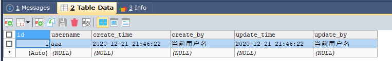

# 启用JPA审计功能
> 很多时候我们需要记录每行数据的创建人、创建时间、修改人、修改时间，达到数据审计作用

审计是什么就不做说明，不是我们的重点。以往情况，我们如何实现呢？无非是在插入或修改数据的时候主动set相关信息进去即可，
这样的工作是繁琐且重复的，难道不能自动去完成这项工作？答案是肯定的。
## JPA审计功能
JPA自带一项审计功能，提供@CreatedDate、@CreatedBy、@LastModifiedDate、@LastModifiedBy注解。
通过名称，一眼就可以知道这几个注解的意思
- @CreatedDate  创建时间
- @CreatedBy 创建人
- @LastModifiedDate 最后修改时间
- @LastModifiedBy 最后修改人

## 实体配置
由于这些字段都是一样的，我们考虑把这些字段放在一个父类中
```
@MappedSuperclass
@EntityListeners(AuditingEntityListener.class)
public class BaseEntity {
    /**
     * 创建时间
     */
    @JsonFormat(pattern="yyyy-MM-dd HH:mm:ss",timezone = "GMT+8")
    @CreatedDate
    @Column(name = "create_time")
    private Date createTime;
    /**
     * 创建人
     */
    @CreatedBy
    @Column(name = "create_by")
    private String createBy;
    /**
     * 修改时间
     */
    @JsonFormat(pattern="yyyy-MM-dd HH:mm:ss",timezone = "GMT+8")
    @LastModifiedDate
    @Column(name = "update_time")
    private Date updateTime;
    /**
     * 修改人
     */
    @LastModifiedBy
    @Column(name = "update_by")
    private String updateBy;

    //省略get、set
}
```

注意，在这个实体上我们用了两个注解
- @MappedSuperclass 这个注解，我们可以将该实体类当成基类实体，它不会映射到数据库表，子类不受影响
- @EntityListeners(AuditingEntityListener.class) 使用jpa审计的关键

另外发现实体属性当中，对字段使用了@CreatedDate、@CreatedBy、@LastModifiedDate、@LastModifiedBy注解

## 实现AuditorAware
如果我们不需要创建人和修改人，那么此过程可以忽略
```
@Component
public class AuditorAwareImpl implements AuditorAware<String> {
    @Override
    public Optional<String> getCurrentAuditor() {
        //这里jpa版本比较高，其他版本可能没有Optional
        //此处可以使用获取当前用户信息来提供用户名
        return Optional.of("当前用户名");
    }
}
```
## @EnableJpaAuditing
启动类上添加 @EnableJpaAuditing

## 总结
关键在于
1. 实体字段注解 @CreatedDate、@CreatedBy、@LastModifiedDate、@LastModifiedBy注解、
2. 实体头部 @EntityListeners(AuditingEntityListener.class)
3. 实现实现AuditorAware（非必须，用到创建人和修改人的时候需要）
3. 启动类添加@EnableJpaAuditing

@CreatedDate、@CreatedBy、@LastModifiedDate、@LastModifiedBy也并非全部使用，可以选择自己需要的

## 测试
创建数据库表
```
CREATE TABLE `user` (
  `id` INT(11) NOT NULL AUTO_INCREMENT,
  `username` VARCHAR(255) DEFAULT NULL,
  `create_time` DATETIME DEFAULT NULL,
  `create_by` VARCHAR(255) DEFAULT NULL,
  `update_time` DATETIME DEFAULT NULL,
  `update_by` VARCHAR(255) DEFAULT NULL,
  PRIMARY KEY (`id`)
) ENGINE=INNODB
```
新建业务类
```
@Service
public class UserService {

    @Autowired
    UserRepository userRepository;

    /**
     * 插入
     *
     * @param username
     * @return
     */
    public UserEntity insert(String username){
        //此处我们只设置一个username
        UserEntity userEntity = new UserEntity();
        userEntity.setUsername(username);
        userRepository.save(userEntity);
        return userEntity;
    }
}
```
新增数据的时候，不要手动设置创建时间和创建人等信息，查看数据库是否自动赋值



上图可见系统已经自动帮进行了赋值操作，因此在实际项目中如果可以把审计字段提取出来，需要数据审计记录的实体直接继承该实体即可


