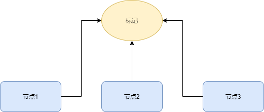
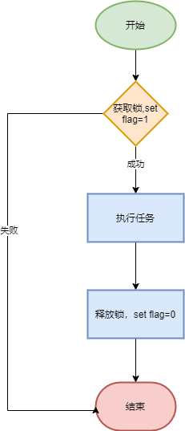

# 基于Redis分布式锁实现
> 为了提升系统稳定性，如今项目基本都是多节点部署，这样同时也带来了一些分布式的问题，比如分布式锁

## 什么是分布式锁？
分布式锁其实可以理解为：控制分布式系统有序的去对共享资源进行操作，通过互斥来保持一致性

举个例子： 试想一下一个定时任务是每天12点准时执行，项目是多个节点部署，这样将会带来什么问题？ 答案是重复执行，
由于多个节点都会在12点执行任务，某些数据可能会被处理多次，因此多个节点必须互斥，一旦一个节点执行了任务，
那么其他节点就必须放弃执行。为了解决这个问题，我们需要一个统一的标记来记录任务执行，各个节点执行的时候
必须先从标记里获取到执行的凭证，否则不允许执行， 这个凭证就是所谓的一个分布式锁

## 实现分布式锁
### 流程演示
通过上面介绍，应该对分布式锁有所了解了，实现分布式锁的关键就是这个标记。为了方便标记暂且用flag表示，当flag=0的时候表示没有节点
在执行任务，当flag=1时表示有节点正在执行。所以我们设定节点谁先把flag值标记为1谁就拿到执行权，当节点执行完任务后再把flag设置为0

在这个过程当中，我们可以将flag=1视作获取锁，将flag=0视作释放锁

### 唯一性
在set flag=1这个过程中，我们必须保证有且只能一个能设置成功，这就跟库存防止超卖类似

解决：利用redis单线程可避免并发问题

### 避免死锁
在set flag=0这个过程中，如果设置失败怎么办？这样后续所有节点都在等待锁释放，造成死锁

解决：利用redis 键失效时间防止解锁失败后死锁问题

## 功能实现
